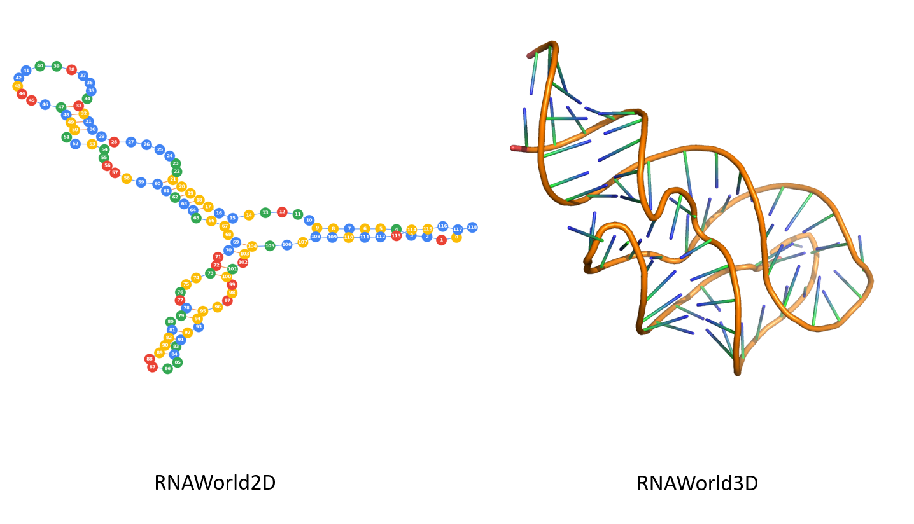
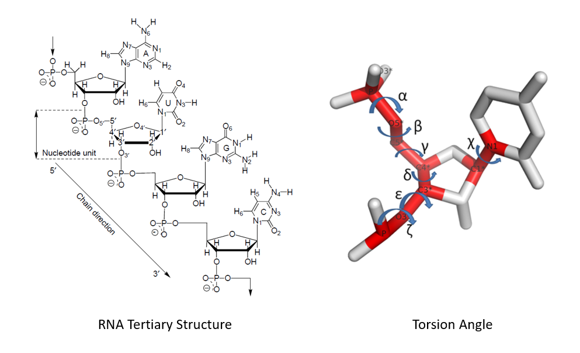

# RNAWorld
A gym environment for the research which apply the reinforcement learning algorithm to the RNA structure prediction.

一个用来训练 RNA 结构预测方面的强化学习算法的 gym 环境。

Please use this bibtex if you want to cite this repository in your publications:

```
@misc{gym_rnaworld,
  author = {Kangkun Mao},
  title = {RNAWorld Environments for OpenAI Gym},
  year = {2019},
  publisher = {GitHub},
  journal = {GitHub repository},
  howpublished = {\url{https://github.com/Urinx/RNAWorld}},
}
```



## Installation

Before using this gym env, you need install the following packages:

```bash
pip install networkx pymol rmsd
```

It is highly recommanded that just clone this repo and directly use it in you code:

```python
from rnaworld import RNAWorld2D, RNAWorld3D
env = RNAWorld2D()
```

But if you want to import it to the gym envs, you need move this repo folder into `envs` folder of the `gym` package:

```bash
mv RNAWorld /path-to-the-gym-package/gym/envs/
```

Then register it in `/path-to-the-gym-package/gym/envs/__init__.py` file:

```python
register(
    id='RNAWorld2D',
    entry_point='gym.envs.RNAWorld:RNAWorld2D',
    max_episode_steps=500,
    reward_threshold=2.0,
    )

register(
    id='RNAWorld3D',
    entry_point='gym.envs.RNAWorld:RNAWorld3D',
    max_episode_steps=500,
    reward_threshold=100.0,
    )
```

After that you can use this env:

```python
import gym
env = gym.make('RNAWorld2D')
```

## Usage

a demo of RNAWorld2D env:

```python
env = RNAWorld2D()
env.seed(2019)
env.random_rna()
ob, node, info = env.reset()
env.render()

print(f'info:\n{info}\nob:\n{ob}\n')

while True:
    # random fold
    if len(env.action_space) > 0:
        idx = np.random.randint(len(env.action_space))
        action = env.action_space[idx]
    else:
        idx = np.random.randint(len(env.pseudoknot_space))
        action = env.pseudoknot_space[idx]
    # native fold
    # action = info['pairs'][len(info['pred_pairs'])]

    ob, reward, done, info = env.step(action)
    env.render()

    print(f"action: {action}\nreward: {reward}\ndone: {done}\nsec:\n{info['sec']}\npred sec:\n{info['pred_sec']}\n")

    if done:
        input()
        break
env.close()
```

a demo of RNAWorld3D env:

```python
env = RNAWorld3D()
env.set_rna('data/1y26.cif')

ob, node, info = env.reset()
env.render()
print(f'info:\n{info}\n')

for _ in range(10):
    # random action
    resi = np.random.randint(0, info['len'])
    #          alpha, beta, gamma, delta, epsilon, zeta, chi
    angles = [ None,  None, None,  None,  None,    None, None ]
    i = np.random.randint(0, 6)
    angle = np.random.randint(-180, 180)
    angles[i] = angle
    action = (resi, angles)

    ob, rmsd, done, info = env.step(action)
    print(f'residue: {i}\nangles: {angles}\nrmsd: {rmsd}\n')
    env.render()

input()
env.save_pdb()
```

## Illustration

In RNAWorld3D env, we don't take the side chain into consider, so every step all you need is to adjust six torsion angle definded in the following graph.


