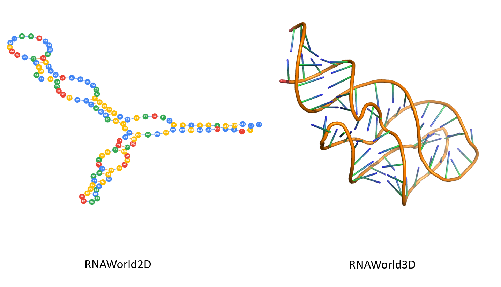

# RNAWorld
A gym environment for the research which apply the reinforcement learning algorithm to the RNA structure prediction.

一个用来训练 RNA 结构预测方面的强化学习算法的 gym 环境。



## Installation

Before using this gym env, you need install the following packages:

```bash
pip install networkx pymol
```

It is highly recommanded that just clone this repo and directly use it in you code:

```python
from rnaworld import RNAWorld2D, RNAWorld3D
env = RNAWorld2D()
```

But if you want to import it to the gym envs, you need move this repo folder into `envs` folder of the `gym` package:

```bash
mv RNAWorld /path-to-the-gym-package/gym/envs/
```

Then register it in `/path-to-the-gym-package/gym/envs/__init__.py` file:

```python
register(
    id='RNAWorld2D',
    entry_point='gym.envs.RNAWorld:RNAWorld2D',
    max_episode_steps=500,
    reward_threshold=2.0,
    )

register(
    id='RNAWorld3D',
    entry_point='gym.envs.RNAWorld:RNAWorld3D',
    max_episode_steps=500,
    reward_threshold=100.0,
    )
```

After that you can use this env:

```python
import gym
env = gym.make('RNAWorld2D')
```

## Usage

a demo of RNAWorld2D env:

```python
env = RNAWorld2D()
env.seed(2019)
env.random_rna()
ob, node, info = env.reset()
env.render()

print(f'info:\n{info}\nob:\n{ob}\n')

while True:
    # random fold
    if len(env.action_space) > 0:
        idx = np.random.randint(len(env.action_space))
        action = env.action_space[idx]
    else:
        idx = np.random.randint(len(env.pseudoknot_space))
        action = env.pseudoknot_space[idx]
    # native fold
    # action = info['pairs'][len(info['pred_pairs'])]

    ob, reward, done, info = env.step(action)
    env.render()

    print(f"action: {action}\nreward: {reward}\ndone: {done}\nsec:\n{info['sec']}\npred sec:\n{info['pred_sec']}\n")

    if done:
        input()
        break
env.close()
```

The RNAWorld3D env is not available, the implement is still on process now, but soon it will be finished.
